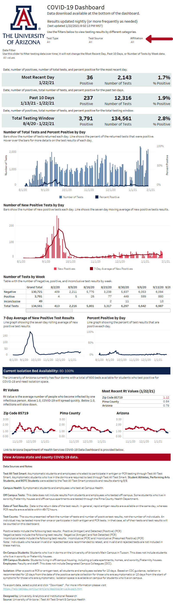

```{r setup, include=FALSE}

options(htmltools.dir.version = FALSE)
knitr::opts_chunk$set(fig.retina = 3, warning = FALSE, message = FALSE)

library(here)
library(tidyverse)
library(xaringanthemer)
library(icons)

 
```

```{r xaringan-themer, include=FALSE, warning=FALSE}

style_duo_accent(
  primary_color = "#46596b",
  secondary_color = "#FFFFFF",
  link_color = choose_dark_or_light("#FFFFFF", "#46596b"),
  header_font_google = google_font("Montserrat"),
  text_font_google   = google_font("Montserrat", "300", "300i"),
  code_font_google   = google_font("Fira Mono"),
  inverse_background_color = "#FFFFFF",
  inverse_header_color = "#FFFFFF",
  inverse_text_color = "#FFFFFF"
)

```

layout: true

---

class: inverse, left, middle

background-image: url(img/Blue-Wire.jpg)
background-size: cover

# Dashboard Accessibility: Focus Order

.large[Jenn Schilling]

.large[Senior Data Analyst, University of Arizona]

.large[AAUDE Annual Meeting | April 2021]


???

I'm Jenn Schilling, and today I'm going to talk about how to set the focus order on a Tableau dashboard. When I made the COVID-19 Dashboard for the University of Arizona, where I work as a Senior Data Analyst, the focus order became an issue immediately after the dashboard went live. I am going to share why focus order matters, how it can be set within Tableau, and the implications to data visualization as a whole.

---


# The Problem

.center[
```{r dpi = 300, echo = FALSE, out.width = '50%'}
knitr::include_graphics("img/dashboard-title.png")
```
]

???

The Problem: the order in which the items on the dashboard are viewed or read by a screen reader does not match the logical order (top to bottom, left to right). 


---

# The Problem

.center[
```{r dpi = 300, echo = FALSE, out.width = '50%'}
knitr::include_graphics("img/dashboard-past-10.png")
```
]


---

# The Problem

.center[
```{r dpi = 300, echo = FALSE, out.width = '50%'}

```
]

---

# The Problem

.center[
```{r dpi = 300, echo = FALSE, out.width = '50%'}

```
]


---

# The Problem

.center[
```{r dpi = 300, echo = FALSE, out.width = '50%'}

```
]

???

To fix the issue, we need to edit the focus order or tab order. This is the order in which the elements of a page are tabbed through. This ordering determins the order in which elements of a page are read by a screen reader.

The dashboard is built in Tableau, and in Tableau, the tab or focus order is based on the order in which items are added to the dashboard when designing or building it

---

# The Solution

1. Save workbook as a `.twb`  

2. Open file in a text editor to edit the `XML`

3. Find the `zone` elements  

4. Set the `id` attribute 

???


1. Save workbook as a `.twb`  

2. Open file in a text editor to edit the `XML`

3. Find the `zone` elements  

4. Set the `id` attribute

To set the ids, it helps to use increments of 10. It's easier to keep track of, and if you add an item later, you can add ids in between the elements that already exist.  

Set your first item (top-left) id to 10, then the next id to 20, etc. until you have put all of the items in order.  

It helps to have a PDF or print-out of the dashboard available while you do this, and it's even better to label the items by id on the print-out before changing the XML. You can also name items within the Tableau workbook prior to editing the XML, which will add helpful names to the XML file zone tags. 

Container id attributes do not matter, but all items within a dashboard must have a unique id.  

If you have multiple layouts within a Tableau workbook, items that are on both a Desktop layout and Mobile layout (for example) must have the same id values.


---

# The Solution

.center[
```{r dpi = 300, echo = FALSE, out.width = '100%'}
knitr::include_graphics("img/tableau-xml.png")
```
]

???

This is an example of the XML file, note the zones, id, and name

---

# The Solution

.center[
```{r dpi = 300, echo = FALSE, out.width = '50%'}
knitr::include_graphics("img/dashboard-title.png")
```
]

???

Now the tab order is correct, and a screen reader will read through the dashboard in order

---

# The Solution

.center[
```{r dpi = 300, echo = FALSE, out.width = '50%'}

```
]

---

# The Solution

.center[
```{r dpi = 300, echo = FALSE, out.width = '50%'}

```
]

---

# The Solution

.center[
```{r dpi = 300, echo = FALSE, out.width = '50%'}

```
]

---

# The Solution

.center[
```{r dpi = 300, echo = FALSE, out.width = '50%'}
knitr::include_graphics("img/dashboard-past-10.png")
```
]

---

## Designing Accessible Data Visualizations

- Include descriptive titles, subtitles, and captions  

???

Include descriptive titles, subtitles, and captions


--

- Use tools that have good screen reader compatability 

???

Not Tableau

--

- Use alt text to describe images

???

Use alt text to describe images

--

- Encode data with sound and visuals

???

Encode data with sound and visuals

--

- Follow [W3C Accessibility Guidelines](https://www.w3.org/TR/2021/WD-wcag-3.0-20210121/)  
  + 2.4.3: Focus Order: "If a Web page can be navigated sequentially and the navigation sequences affect meaning or operation, focusable components receive focus in an order that preserves meaning and operability."  
  
  
???

Follow W3C Accessibility Guidelines  

Including: 2.4.3: Focus Order

Pay attention to how accessible technologies such as screen readers interpret the visualization


---

class: inverse, left, middle

background-image: url(img/Blue-Wire.jpg)
background-size: cover

# Dashboard Accessibility: Focus Order

.large[Jenn Schilling]

.large[Senior Data Analyst, University of Arizona]

.large[AAUDE Annual Meeting | April 2021]

.titlelinks[
<br>`r icon_style(fontawesome("link", style = "solid"), fill = "white")` [jennschilling.me](https://jennschilling.me)
<br>`r icon_style(fontawesome("twitter", style = "brands"), fill = "white")` [datasciencejenn](https://twitter.com/datasciencejenn)
]

