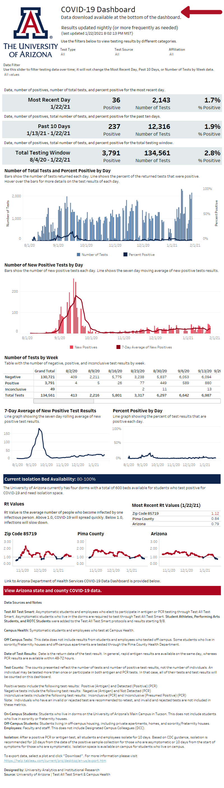
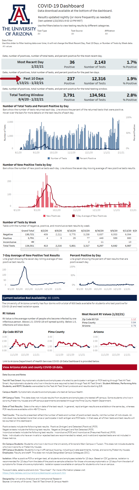

```{r setup, include=FALSE}

options(htmltools.dir.version = FALSE)
knitr::opts_chunk$set(fig.retina = 3, warning = FALSE, message = FALSE)

library(here)
library(tidyverse)
library(xaringanthemer)
library(icon)

 
```

```{r xaringan-themer, include=FALSE, warning=FALSE}

style_duo_accent(
  primary_color = "#30b4a7",
  secondary_color = "#9f5f9c",
  link_color = choose_dark_or_light("#FFFFFF", "#30b4a7"),
  header_font_google = google_font("Josefin Sans"),
  text_font_google   = google_font("Montserrat", "300", "300i"),
  code_font_google   = google_font("Fira Mono"),
  inverse_background_color = "#9f5f9c",
  inverse_header_color = "#FFFFFF",
  inverse_text_color = "#FFFFFF"
)

```

layout: true

<div class="my-footer"><span>`r icon::fontawesome$brands$twitter` datasciencejenn</span></div>

---

class: inverse, left, middle

background-image: url(img/Blue-Wire.jpg)
background-size: cover

# Dashboard Accessiblity: Focus Order

.large[Jenn Schilling]

.large[Outlier | February 2021]

.titlelinks[
<br>`r icon::fontawesome$solid$link` [jennschilling.me](https://jennschilling.me)
<br>`r icon::fontawesome$brands$twitter` [datasciencejenn](https://twitter.com/datasciencejenn)
]

???

I'm Jenn Schilling, and today I'm going to talk about how to set the focus order on a Tableau dashboard. When I made the COVID-19 Dashboard for the University of Arizona, where I work as a Senior Data Analyst, the focus order became an issue immediately after the dashboard went live. I am going to share why focus order matters, how it can be set within Tableau, and the implications to data visualization as a whole.

---


# The Problem

.center[
```{r dpi = 300, echo = FALSE, out.width = '50%'}

```
]

???

The problem 

---

# The Problem

.center[
```{r dpi = 300, echo = FALSE, out.width = '50%'}

```
]


---

# The Problem

.center[
```{r dpi = 300, echo = FALSE, out.width = '50%'}
knitr::include_graphics("img/dashboard-date.png")
```
]

---

# The Problem

.center[
```{r dpi = 300, echo = FALSE, out.width = '50%'}
knitr::include_graphics("img/dashboard-blue.png")
```
]


---

# The Problem

.center[
```{r dpi = 300, echo = FALSE, out.width = '50%'}
knitr::include_graphics("img/dashboard-most-recent.png")
```
]


---


